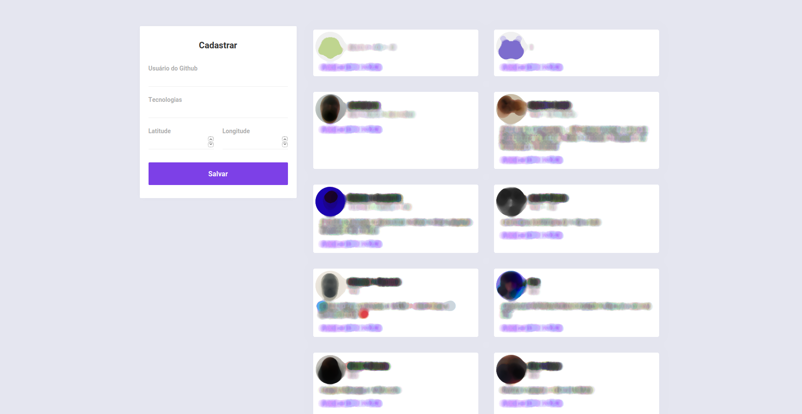

# 10ª Omnistack Week
# Development: Mobile, Frontend, Backend.

# Description
During the week omnistack an application was developed to manage developers close to the user, filtering by their technologies.  
The languages used were: ReactJS, React-Native, NodeJS

# Printscreens

{:height="100px" width="100px"}.

{:height="100px" width="100px"}.

